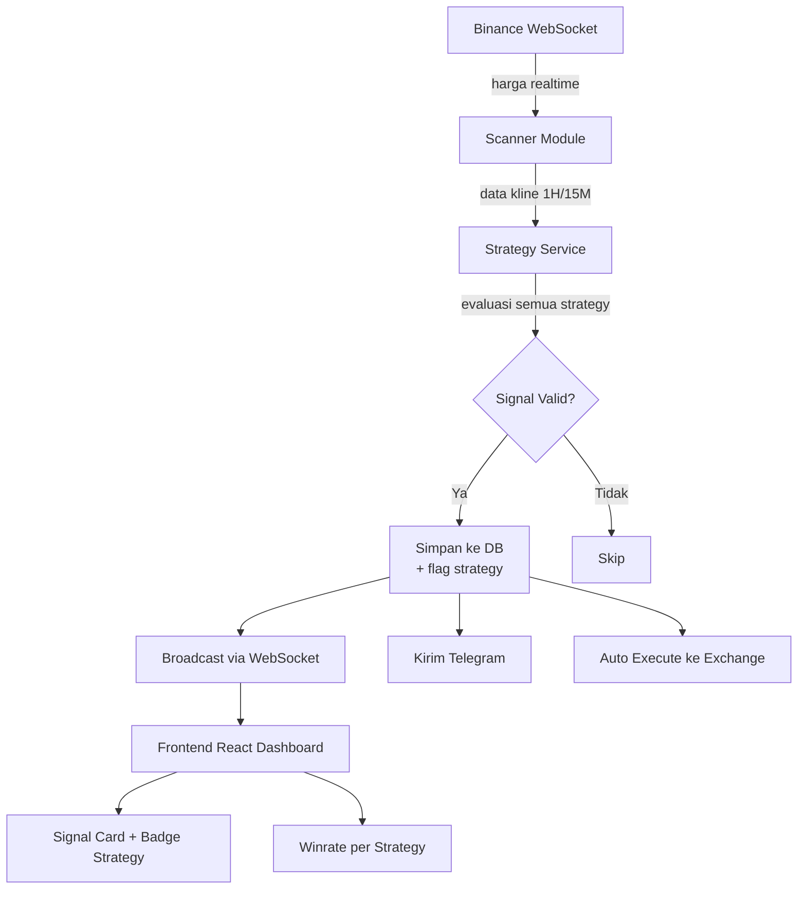

# Rencana Implementasi: Refactor Monorepo (NestJS + React)

## Tujuan
Melakukan refactoring project yang saat ini menggunakan **Go + Vanilla JS + n8n** menjadi ekosistem TypeScript terpadu dengan:
- **Backend:** NestJS + Prisma ORM
- **Frontend:** ReactJS
- **Struktur:** Monorepo dalam satu folder project, dipisah `backend/` dan `frontend/`

Perubahan utama:
1. **Hapus ketergantungan n8n** — semua logika filter, scoring, dan pembuatan signal ditangani langsung di NestJS.
2. **Multi-versioning strategy** — setiap signal diberi flag strategy mana yang menghasilkannya (misal: `breakout_1h_v1`, `prepump_15m_v2`).
3. **Signal history untuk analisa** — semua signal disimpan lengkap dengan metadata strategy-nya, sehingga bisa dihitung winrate per strategy untuk menemukan yang paling profitable.

---

## Perlu Ditinjau User

> [!IMPORTANT]
> **Migrasi Database:** Prisma schema akan di-mapping ke tabel PostgreSQL yang sudah ada. Apakah kita mau konek ke database produksi yang sudah jalan, atau buat database baru untuk testing dulu?

> [!IMPORTANT]  
> **Logika n8n:** Kita perlu menerjemahkan semua aturan filter dari workflow n8n ke dalam TypeScript di NestJS. Apakah Anda bisa share detail logika/kondisi yang ada di n8n?

---

## Pertanyaan Terbuka

> [!WARNING]
> 1. **Detail logika n8n:** Bisa share kriteria spesifik yang dipakai di n8n? (RSI, volume spike, scoring formula, dll.) Supaya bisa diterjemahkan akurat ke Strategy Module di NestJS.
> 2. **UI Framework React:** Mau pakai library komponen seperti **Shadcn UI / Tailwind CSS / Material UI**, atau port langsung CSS lama ke komponen React?
> 3. **Pembersihan kode Go:** Setelah NestJS berjalan dan teruji, apakah kode Go lama dan file HTML di `public/` mau dihapus dari project?

---

## Struktur Folder Baru

```
express-websocket/
├── backend/                        # NestJS + Prisma
│   ├── prisma/
│   │   └── schema.prisma
│   ├── src/
│   │   ├── app.module.ts
│   │   ├── main.ts
│   │   │
│   │   ├── modules/                # 📁 Semua feature modules
│   │   │   ├── auth/
│   │   │   │   ├── auth.module.ts
│   │   │   │   ├── auth.controller.ts
│   │   │   │   ├── auth.service.ts
│   │   │   │   ├── auth.guard.ts
│   │   │   │   └── dto/
│   │   │   │       ├── login.dto.ts
│   │   │   │       └── change-password.dto.ts
│   │   │   │
│   │   │   ├── signal/
│   │   │   │   ├── signal.module.ts
│   │   │   │   ├── signal.controller.ts
│   │   │   │   ├── signal.service.ts
│   │   │   │   └── signal-lifecycle.service.ts  # Monitor TP/SL
│   │   │   │
│   │   │   ├── strategy/               # ⭐ Multi-versioning strategy
│   │   │   │   ├── strategy.module.ts
│   │   │   │   ├── strategy.controller.ts
│   │   │   │   ├── strategy.service.ts
│   │   │   │   ├── strategy.registry.ts
│   │   │   │   ├── strategy.interface.ts
│   │   │   │   └── strategies/          # 📁 Semua strategy files
│   │   │   │       ├── breakout-1h-v1.strategy.ts
│   │   │   │       ├── breakout-1h-v2.strategy.ts
│   │   │   │       ├── prepump-15m-v1.strategy.ts
│   │   │   │       └── btc-session-v1.strategy.ts
│   │   │   │
│   │   │   ├── scanner/                # Market scanner
│   │   │   │   ├── scanner.module.ts
│   │   │   │   ├── scanner.service.ts       # Orchestrator
│   │   │   │   ├── candle-detector.service.ts
│   │   │   │   └── prepump-detector.service.ts
│   │   │   │
│   │   │   ├── binance/                # Binance API integration
│   │   │   │   ├── binance.module.ts
│   │   │   │   ├── binance-ws.service.ts        # WebSocket harga
│   │   │   │   ├── binance-market.service.ts    # REST public (klines, mark price)
│   │   │   │   ├── binance-futures.service.ts   # Trading futures
│   │   │   │   ├── binance-spot.service.ts      # Trading spot
│   │   │   │   └── binance.types.ts
│   │   │   │
│   │   │   ├── execution/              # Auto-execution
│   │   │   │   ├── execution.module.ts
│   │   │   │   ├── execution.controller.ts
│   │   │   │   ├── execution.service.ts
│   │   │   │   └── risk-manager.service.ts
│   │   │   │
│   │   │   ├── analytics/              # ⭐ Winrate per strategy
│   │   │   │   ├── analytics.module.ts
│   │   │   │   ├── analytics.controller.ts
│   │   │   │   └── analytics.service.ts
│   │   │   │
│   │   │   ├── notification/
│   │   │   │   ├── notification.module.ts
│   │   │   │   ├── notification.service.ts
│   │   │   │   └── telegram.service.ts
│   │   │   │
│   │   │   ├── trading-config/
│   │   │   │   ├── trading-config.module.ts
│   │   │   │   ├── trading-config.controller.ts
│   │   │   │   └── trading-config.service.ts
│   │   │   │
│   │   │   ├── donation/
│   │   │   │   ├── donation.module.ts
│   │   │   │   ├── donation.controller.ts
│   │   │   │   └── donation.service.ts
│   │   │   │
│   │   │   ├── backtest/
│   │   │   │   ├── backtest.module.ts
│   │   │   │   ├── backtest.controller.ts
│   │   │   │   └── backtest.service.ts
│   │   │   │
│   │   │   └── websocket/              # WS Gateway (broadcast ke frontend)
│   │   │       ├── websocket.module.ts
│   │   │       └── events.gateway.ts
│   │   │
│   │   ├── common/                 # 📁 Shared: guards, decorators, pipes
│   │   │   ├── guards/
│   │   │   │   ├── jwt-auth.guard.ts
│   │   │   │   └── roles.guard.ts
│   │   │   ├── decorators/
│   │   │   │   ├── current-user.decorator.ts
│   │   │   │   └── roles.decorator.ts
│   │   │   ├── pipes/
│   │   │   │   └── parse-symbol.pipe.ts
│   │   │   ├── interceptors/
│   │   │   │   └── logging.interceptor.ts
│   │   │   └── filters/
│   │   │       └── http-exception.filter.ts
│   │   │
│   │   ├── config/                 # 📁 App configuration
│   │   │   ├── app.config.ts
│   │   │   └── binance.config.ts
│   │   │
│   │   ├── prisma/                 # 📁 Prisma service wrapper
│   │   │   ├── prisma.module.ts
│   │   │   └── prisma.service.ts
│   │   │
│   │   └── utils/                  # 📁 Utility functions
│   │       ├── math.util.ts            # roundFloat, roundStepSize
│   │       ├── price.util.ts           # parseFloat, formatFloat
│   │       ├── time.util.ts            # formatDuration, currentSession
│   │       └── crypto.util.ts          # hash, hmac (untuk auth)
│   │
│   ├── test/
│   │   ├── strategy.spec.ts
│   │   └── signal.e2e-spec.ts
│   ├── package.json
│   └── tsconfig.json
│
├── frontend/                       # ReactJS + Shadcn
│   ├── src/
│   │   ├── App.tsx
│   │   ├── main.tsx
│   │   ├── pages/
│   │   │   ├── Dashboard.tsx
│   │   │   ├── Admin.tsx
│   │   │   ├── Login.tsx
│   │   │   └── StrategyManager.tsx      # ⭐ Switch strategy on/off
│   │   ├── components/
│   │   │   ├── ui/                      # Shadcn components (auto-generated)
│   │   │   ├── SignalCard.tsx
│   │   │   ├── SignalStats.tsx
│   │   │   ├── StrategyWinrate.tsx
│   │   │   ├── NotificationPanel.tsx
│   │   │   └── TradingConfigForm.tsx
│   │   ├── hooks/
│   │   │   ├── useWebSocket.ts
│   │   │   ├── useSignals.ts
│   │   │   └── useStrategies.ts
│   │   ├── services/
│   │   │   └── api.ts
│   │   ├── lib/
│   │   │   └── utils.ts                 # Shadcn utils (cn helper)
│   │   └── types/
│   │       ├── signal.ts
│   │       └── strategy.ts
│   ├── components.json                  # Shadcn config
│   ├── package.json
│   └── tsconfig.json
│
├── package.json                    # Root workspace
└── README.md
```

---

## Perubahan Detail

### 1. Prisma Schema (Database)

#### [BARU] `backend/prisma/schema.prisma`

Model utama yang akan dibuat:

```prisma
model User {
  id           String   @id @default(uuid())
  username     String   @unique
  passwordSalt String   @map("password_salt")
  passwordHash String   @map("password_hash")
  role         String   @default("user")
  isActive     Boolean  @default(true) @map("is_active")
  createdAt    DateTime @default(now()) @map("created_at")

  sessions      UserSession[]
  tradingConfig UserTradingConfig?
  positionLocks UserPositionLock[]

  @@map("users")
}

model Signal {
  id           String    @id @default(uuid())
  symbol       String
  signal       String                          // BUY / SELL
  signalType   String?   @map("signal_type")
  entryPrice   Float?    @map("entry_price")
  tp1          Float?
  tp2          Float?
  tp3          Float?
  sl           Float?
  score        Float?
  confidence   String?
  strategy     String?                         // ⭐ Flag strategy: "breakout_1h_v1", "prepump_15m_v2", dll
  strategyVersion String? @map("strategy_version") // ⭐ Versi strategy
  reasons      String?
  status       String    @default("ACTIVE")
  profitPct    Float?    @map("profit_pct")
  currentPrice Float?    @map("current_price")
  duration     String?
  sentAt       DateTime? @map("sent_at")
  hitTime      DateTime? @map("hit_time")

  @@map("signals")
}

model Notification {
  id        String   @id @default(uuid())
  type      String?
  symbol    String?
  side      String?
  price     Float?
  profitPct Float?   @map("profit_pct")
  createdAt DateTime @default(now()) @map("created_at")

  @@map("notifications")
}
```

> Model lain (`UserSession`, `UserTradingConfig`, `UserPositionLock`, `Donation`) juga akan dibuat sesuai skema Go yang sudah ada.

---

### 2. Strategy Module (Pengganti n8n) ⭐

#### [BARU] `backend/src/strategy/strategy.interface.ts`

```typescript
export interface StrategyResult {
  shouldSignal: boolean;
  signal: 'BUY' | 'SELL';
  entryPrice: number;
  tp1: number;
  tp2: number;
  tp3: number;
  sl: number;
  score: number;
  confidence: string;
  reasons: string[];
}

export interface IStrategy {
  name: string;        // misal: "breakout_1h"
  version: string;     // misal: "v1", "v2"
  evaluate(data: MarketData): Promise<StrategyResult | null>;
}
```

#### [BARU] `backend/src/strategy/strategies/breakout-1h.strategy.ts`
- Mendeteksi candle 1H breakout/breakdown.
- Menghitung EMA, RSI, MACD, ATR.
- Menghasilkan signal dengan flag `strategy: "breakout_1h"`, `strategyVersion: "v1"`.

#### [BARU] `backend/src/strategy/strategies/prepump-15m.strategy.ts`
- Mendeteksi pre-pump/pre-dump berdasarkan volume spike, konsolidasi, taker ratio.
- Menghasilkan signal dengan flag `strategy: "prepump_15m"`, `strategyVersion: "v1"`.

#### [BARU] `backend/src/strategy/strategy.service.ts`

```typescript
@Injectable()
export class StrategyService {
  private strategies: IStrategy[] = [];

  registerStrategy(strategy: IStrategy) {
    this.strategies.push(strategy);
  }

  async evaluateAll(data: MarketData): Promise<void> {
    for (const strategy of this.strategies) {
      const result = await strategy.evaluate(data);
      if (result && result.shouldSignal) {
        // Simpan signal ke database dengan flag strategy
        await this.signalService.create({
          ...result,
          strategy: strategy.name,
          strategyVersion: strategy.version,
        });
      }
    }
  }
}
```

**Keuntungan dibanding n8n:**
- Tidak perlu request HTTP ke luar (lebih cepat).
- Semua logika ada dalam satu codebase (mudah debug dan test).
- Mudah menambah strategy baru: tinggal buat class baru yang implement `IStrategy`.

---

### 3. Analytics Module (Winrate per Strategy) ⭐

#### [BARU] `backend/src/analytics/analytics.service.ts`

```typescript
@Injectable()
export class AnalyticsService {
  async getWinrateByStrategy(): Promise<StrategyWinrate[]> {
    // Query: GROUP BY strategy, hitung win/loss/winrate
    return this.prisma.$queryRaw`
      SELECT 
        strategy,
        strategy_version,
        COUNT(*) as total_signals,
        COUNT(*) FILTER (WHERE status IN ('TP1_HIT','TP2_HIT','TP3_HIT','TSL_HIT')) as wins,
        COUNT(*) FILTER (WHERE status = 'SL_HIT') as losses,
        ROUND(
          COUNT(*) FILTER (WHERE status IN ('TP1_HIT','TP2_HIT','TP3_HIT','TSL_HIT'))::numeric * 100 
          / NULLIF(COUNT(*) FILTER (WHERE status IN ('TP1_HIT','TP2_HIT','TP3_HIT','TSL_HIT','SL_HIT')), 0)
        , 2) as winrate,
        COALESCE(AVG(profit_pct) FILTER (WHERE status IN ('TP1_HIT','TP2_HIT','TP3_HIT','TSL_HIT','SL_HIT')), 0) as avg_pnl,
        COALESCE(SUM(profit_pct) FILTER (WHERE status IN ('TP1_HIT','TP2_HIT','TP3_HIT','TSL_HIT','SL_HIT')), 0) as total_pnl
      FROM signals
      WHERE strategy IS NOT NULL
      GROUP BY strategy, strategy_version
      ORDER BY winrate DESC
    `;
  }
}
```

**Endpoint baru:**
- `GET /api/analytics/winrate` — Winrate per strategy
- `GET /api/analytics/winrate?strategy=breakout_1h` — Detail winrate strategy tertentu
- `GET /api/analytics/compare` — Perbandingan semua strategy side-by-side

---

### 4. Scanner Module (Pengganti Go Engine)

#### [BARU] `backend/src/scanner/scanner.service.ts`
- Koneksi ke Binance WebSocket untuk harga realtime.
- Fetch historical klines (1H dan 15M).
- Kirim data ke `StrategyService.evaluateAll()` (bukan ke n8n lagi).

#### [BARU] `backend/src/scanner/binance-ws.gateway.ts`
- NestJS WebSocket Gateway untuk broadcast harga ke frontend.

---

### 5. Signal Lifecycle Monitor

#### [BARU] `backend/src/signal/signal-lifecycle.service.ts`
- Cron job (menggunakan `@nestjs/schedule`) yang berjalan setiap beberapa detik.
- Mengecek mark price vs entry/TP/SL.
- Update status signal (`ACTIVE` → `TP1_HIT` → `TP2_HIT` → `TP3_HIT` / `SL_HIT` / `TSL_HIT`).
- Broadcast refresh ke frontend via WebSocket.
- Kirim notifikasi Telegram.

---

### 6. Frontend React

#### [BARU] `frontend/src/components/StrategyWinrate.tsx`
Komponen baru untuk menampilkan perbandingan winrate antar strategy:

```
┌────────────────────────────────────────────────┐
│  📊 Perbandingan Winrate Strategy              │
├──────────────┬───────┬────────┬────────┬───────┤
│ Strategy     │ Total │ Win    │ Loss   │ WR%   │
├──────────────┼───────┼────────┼────────┼───────┤
│ breakout_1h  │ 245   │ 178    │ 67     │ 72.6% │
│ prepump_15m  │ 132   │ 89     │ 43     │ 67.4% │
│ btc_special  │ 58    │ 45     │ 13     │ 77.6% │
└──────────────┴───────┴────────┴────────┴───────┘
```

#### [BARU] `frontend/src/components/SignalCard.tsx`
- Menampilkan badge strategy pada setiap signal card.
- Warna berbeda untuk strategy berbeda agar mudah dibedakan.

---

## Mapping: Kode Lama → Kode Baru

| Kode Go Lama | Kode NestJS Baru |
|---|---|
| `cmd/server/main.go` | `backend/src/main.ts` + `app.module.ts` |
| `internal/engine/n8n.go` | ❌ **Dihapus** — diganti `strategy/` module |
| `internal/engine/scanner.go` | `backend/src/scanner/scanner.service.ts` |
| `internal/engine/candle.go` | `backend/src/scanner/candle-detector.service.ts` |
| `internal/engine/lifecycle.go` | `backend/src/signal/signal-lifecycle.service.ts` |
| `internal/engine/filter.go` | `backend/src/strategy/strategies/*.strategy.ts` |
| `internal/api/executor.go` | `backend/src/execution/binance-executor.service.ts` |
| `internal/api/bitunix_executor.go` | `backend/src/execution/bitunix-executor.service.ts` |
| `internal/api/auth.go` | `backend/src/auth/auth.service.ts` |
| `internal/api/public_handlers.go` | `backend/src/signal/signal.controller.ts` |
| `internal/database/postgres.go` | `backend/prisma/schema.prisma` (otomatis) |
| `public/index.html` | `frontend/src/pages/Dashboard.tsx` |
| `public/admin.html` | `frontend/src/pages/Admin.tsx` |
| `public/assets/js/*.js` | `frontend/src/components/*.tsx` + `hooks/*.ts` |

---

## Alur Kerja Baru (Tanpa n8n)



---

## Rencana Verifikasi

### Test Otomatis
```bash
# Backend
cd backend
npm run test           # Unit test strategy logic
npx prisma db push     # Verifikasi schema ke database
npm run test:e2e       # End-to-end test API

# Frontend
cd frontend
npm run test           # Test komponen React
npm run build          # Pastikan build sukses
```

### Verifikasi Manual
1. **Jalankan kedua server** (NestJS + React dev server).
2. **Cek signal generation** — inject data mock atau tunggu trigger Binance. Pastikan signal tersimpan dengan flag `strategy` yang benar.
3. **Cek database** — pastikan kolom `strategy` dan `strategy_version` terisi.
4. **Cek winrate endpoint** — akses `/api/analytics/winrate` dan verifikasi hasilnya benar.
5. **Cek dashboard** — pastikan signal card menampilkan badge strategy, dan halaman winrate berfungsi.
6. **Pastikan n8n tidak diperlukan lagi** — semua flow berjalan internal di NestJS.
