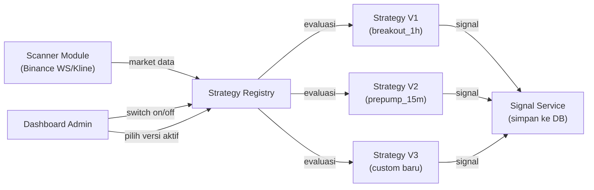

# Detail Arsitektur: Strategy Module + Dashboard Switching

## Konsep Utama

Setiap **strategy** adalah sebuah class TypeScript yang mengimplementasikan interface `IStrategy`. Strategy disimpan di folder `backend/src/strategy/strategies/` dengan naming convention yang jelas. Semua strategy **otomatis ter-register** ke `StrategyRegistry`, sehingga dashboard bisa menampilkan daftar strategy + versi yang tersedia untuk di-switch.

---

## Alur Kerja Strategy



---

## 1. Strategy Interface (Template)

File: `backend/src/strategy/strategy.interface.ts`

```typescript
/**
 * Metadata strategy yang akan ditampilkan di Dashboard.
 * Setiap strategy WAJIB mengisi metadata ini.
 */
export interface StrategyMeta {
  /** ID unik strategy (snake_case) */
  id: string;           // e.g. "breakout_1h"
  
  /** Nama tampilan di dashboard */
  displayName: string;  // e.g. "Breakout 1H Candle"
  
  /** Deskripsi singkat */
  description: string;  // e.g. "Mendeteksi candle 1H dengan pergerakan harga signifikan"
  
  /** Versi strategy */
  version: string;      // e.g. "v1", "v2", "v3"
  
  /** Author/pembuat */
  author: string;       // e.g. "admin"
  
  /** Timeframe yang digunakan */
  timeframe: string;    // e.g. "1h", "15m", "4h"
  
  /** Indikator yang digunakan */
  indicators: string[]; // e.g. ["EMA", "RSI", "MACD", "ATR"]
  
  /** Default: aktif atau tidak */
  defaultEnabled: boolean;
}

/**
 * Data market yang diterima strategy untuk evaluasi
 */
export interface MarketData {
  symbol: string;
  lastPrice: number;
  highPrice: number;
  lowPrice: number;
  volume: number;
  quoteVolume: number;
  priceChangePct: number;
  candles?: CandleData[];      // Historical klines
  takerBuyVolume?: number;
  direction?: string;
  triggerSource?: string;
}

export interface CandleData {
  openTime: number;
  open: number;
  high: number;
  low: number;
  close: number;
  volume: number;
  closeTime: number;
  takerBuyVolume?: number;
}

/**
 * Hasil evaluasi strategy
 */
export interface StrategyResult {
  shouldSignal: boolean;
  signal: 'BUY' | 'SELL' | 'STRONG BUY' | 'STRONG SELL';
  signalType: 'LONG' | 'SHORT';
  entryPrice: number;
  tp1: number;
  tp2: number;
  tp3: number;
  sl: number;
  score: number;          // 0-100
  confidence: 'HIGH' | 'MEDIUM' | 'LOW';
  reasons: string[];
}

/**
 * ═══════════════════════════════════════════════
 * INTERFACE UTAMA — Semua strategy WAJIB implement ini
 * ═══════════════════════════════════════════════
 * 
 * Untuk membuat strategy baru:
 * 1. Buat file baru di `strategies/` folder
 * 2. Implement IStrategy
 * 3. Decorate dengan @Strategy() decorator
 * 4. Otomatis muncul di dashboard!
 */
export interface IStrategy {
  /** Metadata strategy (untuk ditampilkan di dashboard) */
  meta: StrategyMeta;
  
  /** 
   * Evaluasi market data. Return null jika tidak ada signal.
   * Return StrategyResult jika ada signal valid.
   */
  evaluate(data: MarketData): Promise<StrategyResult | null>;
}
```

---

## 2. Strategy Registry (Auto-Discovery)

File: `backend/src/strategy/strategy.registry.ts`

```typescript
import { Injectable, OnModuleInit } from '@nestjs/common';
import { ModuleRef, DiscoveryService } from '@nestjs/core';
import { IStrategy, StrategyMeta } from './strategy.interface';

/**
 * Status strategy yang disimpan di database (bisa di-switch dari dashboard)
 */
export interface StrategyStatus {
  strategyId: string;
  version: string;
  isEnabled: boolean;
  enabledAt?: Date;
  disabledAt?: Date;
}

@Injectable()
export class StrategyRegistry implements OnModuleInit {
  /** Semua strategy yang terdaftar */
  private strategies: Map<string, IStrategy> = new Map();
  
  /** Status aktif/nonaktif per strategy (dari DB) */
  private activeStrategies: Map<string, boolean> = new Map();

  constructor(
    private readonly discoveryService: DiscoveryService,
    private readonly prisma: PrismaService,
  ) {}

  async onModuleInit() {
    // Auto-discover semua class yang di-decorate @Strategy()
    const providers = this.discoveryService.getProviders();
    for (const wrapper of providers) {
      const instance = wrapper.instance;
      if (instance && this.isStrategy(instance)) {
        const key = `${instance.meta.id}@${instance.meta.version}`;
        this.strategies.set(key, instance);
      }
    }

    // Load status dari database
    await this.loadActiveStrategies();
  }

  /** Cek apakah instance implement IStrategy */
  private isStrategy(instance: any): instance is IStrategy {
    return instance.meta && instance.evaluate && typeof instance.evaluate === 'function';
  }

  /** Load strategy status dari tabel strategy_configs */
  async loadActiveStrategies() {
    const configs = await this.prisma.strategyConfig.findMany();
    for (const config of configs) {
      const key = `${config.strategyId}@${config.version}`;
      this.activeStrategies.set(key, config.isEnabled);
    }
  }

  // ═══════════════════════════════════════════════
  // API untuk Dashboard
  // ═══════════════════════════════════════════════

  /** Dapatkan semua strategy yang terdaftar (untuk ditampilkan di dashboard) */
  getAllStrategies(): StrategyMeta[] {
    return Array.from(this.strategies.values()).map(s => s.meta);
  }

  /** Cek apakah strategy aktif */
  isEnabled(strategyId: string, version: string): boolean {
    const key = `${strategyId}@${version}`;
    const status = this.activeStrategies.get(key);
    if (status !== undefined) return status;
    // Fallback ke default
    const strategy = this.strategies.get(key);
    return strategy?.meta.defaultEnabled ?? false;
  }

  /** Enable/disable strategy dari dashboard */
  async toggleStrategy(strategyId: string, version: string, enabled: boolean) {
    const key = `${strategyId}@${version}`;
    this.activeStrategies.set(key, enabled);
    
    // Persist ke database
    await this.prisma.strategyConfig.upsert({
      where: { strategyId_version: { strategyId, version } },
      update: { isEnabled: enabled, updatedAt: new Date() },
      create: { strategyId, version, isEnabled: enabled },
    });
  }

  // ═══════════════════════════════════════════════
  // API untuk Scanner (evaluasi market data)
  // ═══════════════════════════════════════════════

  /** Dapatkan semua strategy yang AKTIF */
  getActiveStrategies(): IStrategy[] {
    return Array.from(this.strategies.entries())
      .filter(([key]) => {
        const [id, version] = key.split('@');
        return this.isEnabled(id, version);
      })
      .map(([, strategy]) => strategy);
  }
}
```

---

## 3. Contoh Strategy: Breakout 1H

File: `backend/src/strategy/strategies/breakout-1h-v1.strategy.ts`

```typescript
import { Injectable } from '@nestjs/common';
import { IStrategy, StrategyMeta, MarketData, StrategyResult } from '../strategy.interface';

@Injectable()
export class Breakout1HV1Strategy implements IStrategy {
  
  // ═══════════════════════════════════════════════
  // METADATA — Ini yang ditampilkan di Dashboard
  // ═══════════════════════════════════════════════
  meta: StrategyMeta = {
    id: 'breakout_1h',
    displayName: 'Breakout 1H Candle',
    description: 'Mendeteksi candle 1H yang menembus threshold perubahan harga signifikan. Cocok untuk momentum trading.',
    version: 'v1',
    author: 'admin',
    timeframe: '1h',
    indicators: ['Price Change %', 'Volume', 'Quote Volume'],
    defaultEnabled: true,
  };

  // ═══════════════════════════════════════════════
  // LOGIKA EVALUASI — Migrasi dari Go candle.go
  // ═══════════════════════════════════════════════
  async evaluate(data: MarketData): Promise<StrategyResult | null> {
    if (!data.candles || data.candles.length < 2) return null;

    const lastClosed = data.candles[data.candles.length - 2];
    if (lastClosed.open <= 0) return null;

    const changePct = ((lastClosed.close - lastClosed.open) / lastClosed.open) * 100;
    const threshold = 2.0; // Bisa di-config nanti

    if (Math.abs(changePct) < threshold) return null;

    const isLong = changePct > 0;
    const entry = lastClosed.close;
    const risk = entry * 0.02; // 2% risk

    return {
      shouldSignal: true,
      signal: isLong ? 'STRONG BUY' : 'STRONG SELL',
      signalType: isLong ? 'LONG' : 'SHORT',
      entryPrice: entry,
      tp1: isLong ? entry + risk * 1.5 : entry - risk * 1.5,
      tp2: isLong ? entry + risk * 3.0 : entry - risk * 3.0,
      tp3: isLong ? entry + risk * 5.0 : entry - risk * 5.0,
      sl:  isLong ? entry - risk       : entry + risk,
      score: 75,
      confidence: 'MEDIUM',
      reasons: [
        `1H candle change: ${changePct.toFixed(2)}%`,
        `Volume: ${lastClosed.volume.toFixed(2)}`,
      ],
    };
  }
}
```

---

## 4. Contoh Strategy V2 (Versi Baru)

File: `backend/src/strategy/strategies/breakout-1h-v2.strategy.ts`

```typescript
@Injectable()
export class Breakout1HV2Strategy implements IStrategy {
  meta: StrategyMeta = {
    id: 'breakout_1h',
    displayName: 'Breakout 1H Candle (Enhanced)',
    description: 'V2: Ditambah filter EMA 50/200, RSI, dan validasi volume spike.',
    version: 'v2',
    author: 'admin',
    timeframe: '1h',
    indicators: ['EMA 50', 'EMA 200', 'RSI', 'Volume Spike', 'Price Change %'],
    defaultEnabled: false, // Belum aktif by default
  };

  async evaluate(data: MarketData): Promise<StrategyResult | null> {
    // Logika V2 yang lebih advance...
    // - Cek EMA crossover
    // - Cek RSI oversold/overbought
    // - Cek volume spike dibanding rata-rata
    // ...
    return null;
  }
}
```

---

## 5. Cara Menambah Strategy Baru (Template)

Untuk menambah strategy baru, Anda hanya perlu:

```typescript
// File: backend/src/strategy/strategies/nama-strategy-v1.strategy.ts

import { Injectable } from '@nestjs/common';
import { IStrategy, StrategyMeta, MarketData, StrategyResult } from '../strategy.interface';

@Injectable()
export class NamaStrategyV1 implements IStrategy {
  
  // 1. ISI METADATA
  meta: StrategyMeta = {
    id: 'nama_strategy',          // ID unik (snake_case)
    displayName: 'Nama Strategy', // Tampilan di dashboard
    description: 'Deskripsi...',  // Penjelasan singkat
    version: 'v1',                // Versi
    author: 'admin',
    timeframe: '15m',
    indicators: ['RSI', 'MACD'],
    defaultEnabled: false,
  };

  // 2. ISI LOGIKA
  async evaluate(data: MarketData): Promise<StrategyResult | null> {
    // Tulis logika evaluasi di sini
    // Return null = tidak ada signal
    // Return StrategyResult = ada signal!
    return null;
  }
}

// 3. Register di strategy.module.ts (providers array)
```

**Setelah itu, strategy langsung muncul di dashboard dan bisa di-switch on/off!**

---

## 6. Tabel Database Baru: `strategy_configs`

Untuk menyimpan status on/off setiap strategy:

```prisma
model StrategyConfig {
  strategyId String  @map("strategy_id")
  version    String
  isEnabled  Boolean @default(false) @map("is_enabled")
  updatedAt  DateTime @default(now()) @updatedAt @map("updated_at")

  @@id([strategyId, version])
  @@map("strategy_configs")
}
```

---

## 7. API Endpoint Strategy

| Method | Endpoint | Deskripsi |
|---|---|---|
| `GET` | `/api/strategies` | Daftar semua strategy + status aktif/nonaktif |
| `PATCH` | `/api/strategies/:id/toggle` | Switch on/off strategy |
| `GET` | `/api/analytics/winrate` | Winrate per strategy |
| `GET` | `/api/analytics/winrate/:strategyId` | Detail winrate strategy tertentu |

### Contoh Response `GET /api/strategies`:

```json
[
  {
    "id": "breakout_1h",
    "displayName": "Breakout 1H Candle",
    "description": "Mendeteksi candle 1H yang menembus threshold...",
    "version": "v1",
    "timeframe": "1h",
    "indicators": ["Price Change %", "Volume", "Quote Volume"],
    "isEnabled": true,
    "winrate": 72.65,
    "totalSignals": 245
  },
  {
    "id": "breakout_1h",
    "displayName": "Breakout 1H Candle (Enhanced)",
    "description": "V2: Ditambah filter EMA 50/200, RSI...",
    "version": "v2",
    "timeframe": "1h",
    "indicators": ["EMA 50", "EMA 200", "RSI", "Volume Spike"],
    "isEnabled": false,
    "winrate": null,
    "totalSignals": 0
  },
  {
    "id": "prepump_15m",
    "displayName": "Pre-Pump 15M Scanner",
    "description": "Deteksi akumulasi volume di zona konsolidasi...",
    "version": "v1",
    "timeframe": "15m",
    "indicators": ["Volume Ratio", "Range %", "Taker Buy Ratio", "Prior Trend"],
    "isEnabled": true,
    "winrate": 67.42,
    "totalSignals": 132
  }
]
```

---

## 8. Dashboard UI (Shadcn Components)

### Strategy Manager Page

Menggunakan komponen Shadcn:
- **Card** — untuk setiap strategy
- **Switch** — toggle on/off
- **Badge** — status (Active/Inactive), version, timeframe
- **Table** — winrate comparison
- **Dialog** — konfirmasi switch

```
┌─────────────────────────────────────────────────────────────┐
│  ⚙️ Strategy Manager                                        │
├─────────────────────────────────────────────────────────────┤
│                                                             │
│  ┌─── Card ──────────────────────────────────────────────┐  │
│  │  Breakout 1H Candle                      [Switch: ON] │  │
│  │  Badge: v1 | 1h | Active ✅                           │  │
│  │  Indicators: Price Change %, Volume, Quote Volume      │  │
│  │  📊 Winrate: 72.65% | Total: 245 signals              │  │
│  └───────────────────────────────────────────────────────┘  │
│                                                             │
│  ┌─── Card ──────────────────────────────────────────────┐  │
│  │  Breakout 1H Candle (Enhanced)          [Switch: OFF] │  │
│  │  Badge: v2 | 1h | Inactive ⬚                          │  │
│  │  Indicators: EMA 50, EMA 200, RSI, Volume Spike        │  │
│  │  📊 Winrate: — | Total: 0 signals                     │  │
│  └───────────────────────────────────────────────────────┘  │
│                                                             │
│  ┌─── Card ──────────────────────────────────────────────┐  │
│  │  Pre-Pump 15M Scanner                   [Switch: ON]  │  │
│  │  Badge: v1 | 15m | Active ✅                           │  │
│  │  Indicators: Volume Ratio, Range %, Taker Buy, Prior   │  │
│  │  📊 Winrate: 67.42% | Total: 132 signals              │  │
│  └───────────────────────────────────────────────────────┘  │
│                                                             │
├─────────────────────────────────────────────────────────────┤
│  📊 Winrate Comparison                                      │
│  ┌──────────────┬─────────┬──────┬────────┬──────────────┐ │
│  │ Strategy     │ Version │ Win  │ Loss   │ Winrate      │ │
│  ├──────────────┼─────────┼──────┼────────┼──────────────┤ │
│  │ breakout_1h  │ v1      │ 178  │ 67     │ 72.65% ████▓ │ │
│  │ prepump_15m  │ v1      │ 89   │ 43     │ 67.42% ███▓░ │ │
│  └──────────────┴─────────┴──────┴────────┴──────────────┘ │
└─────────────────────────────────────────────────────────────┘
```

### Shadcn Components yang Dipakai:

| Komponen Shadcn | Kegunaan |
|---|---|
| `Card`, `CardHeader`, `CardContent` | Container tiap strategy |
| `Switch` | Toggle on/off strategy |
| `Badge` | Label version, timeframe, status |
| `Table` | Tabel winrate comparison |
| `Dialog` + `AlertDialog` | Konfirmasi switch strategy |
| `Tabs` | Tab antara Strategy Manager dan Winrate Analytics |
| `Select` | Filter berdasarkan timeframe |
| `Progress` | Visual winrate bar |
| `Tooltip` | Info detail indikator |
| `Sonner` (Toast) | Notifikasi setelah switch strategy |

---

## 9. Struktur File Strategy Module

```
backend/src/strategy/
├── strategy.interface.ts          # Interface IStrategy + StrategyMeta
├── strategy.module.ts             # NestJS Module (register semua strategy)
├── strategy.registry.ts           # Registry: auto-discover + toggle
├── strategy.service.ts            # Service: evaluasi market data
├── strategy.controller.ts         # API: GET /api/strategies, PATCH toggle
└── strategies/                    # 📁 Folder semua strategy
    ├── breakout-1h-v1.strategy.ts    # Breakout 1H v1
    ├── breakout-1h-v2.strategy.ts    # Breakout 1H v2 (enhanced)
    ├── prepump-15m-v1.strategy.ts    # Pre-Pump 15M v1
    ├── prepump-15m-v2.strategy.ts    # Pre-Pump 15M v2
    └── btc-session-v1.strategy.ts    # BTC Session trigger v1
```

---

## Ringkasan Konsep

> [!TIP]
> **Menambah strategy baru = buat 1 file .ts baru di folder `strategies/`.**  
> Cukup implement `IStrategy`, isi `meta` dan `evaluate()`, lalu register di module.  
> Otomatis muncul di dashboard, bisa di-switch on/off, dan winrate-nya ter-track.

> [!NOTE]
> Strategy V1 dan V2 dari `breakout_1h` bisa **hidup bersamaan**. Keduanya akan meng-evaluasi market data, tapi hanya yang **enabled** yang menghasilkan signal. Ini memungkinkan Anda untuk A/B testing strategy secara live.
